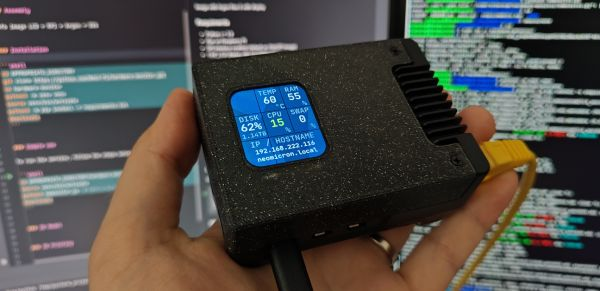

# Hardware Monitor (on LCD)

The project enables the display of Raspberry Pi parameters and Ethereum node information on a 1.69" LCD screen (ST7789V2 Driver Chip).

<p align="center">
  
</p>


### Requiments

- Python >= 3.9
- Run on Raspberry Pi
- SPI interface enabled (default on Web3Pi image)
- 1.69" LCD display with ST7789V2 Driver
  - Waveshare 24382 - [product page](https://www.waveshare.com/1.69inch-lcd-module.htm)
  - Seeed Studio 104990802 - [product page](https://www.seeedstudio.com/1-69inch-240-280-Resolution-IPS-LCD-Display-Module-p-5755.html)


### Assembly

Info image LCD + RPI + Argon = XXX


### Installation

```shell
cd APPROPRIATE_DIRECTORY
git clone https://github.com/Web3-Pi/hardware-monitor.git
cd hardware-monitor
python3 -m venv venv
source venv/bin/activate
python3 -m pip install -r requirements.txt
deactivate
```


### Simple use

To run the service, follow the steps below:

```shell
cd APPROPRIATE_DIRECTORY/hardware-monitor
source venv/bin/activate
python3 hwmonitor.py  # Ctrl-c to shut down the monitor
deactivate
```


### 3D Model


### 3D Printing

