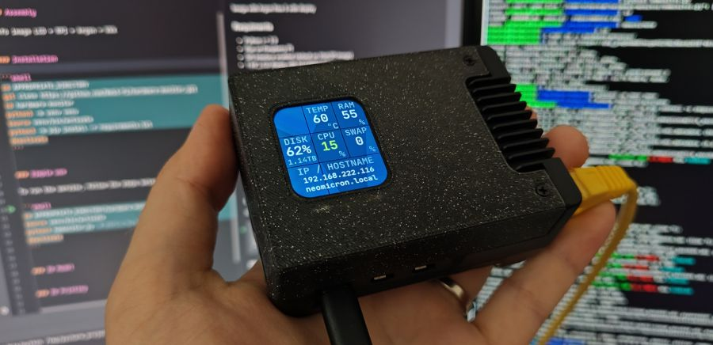
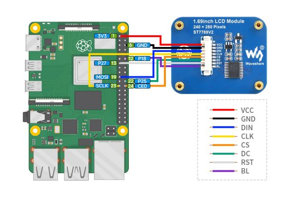
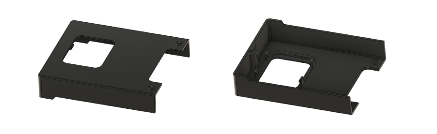
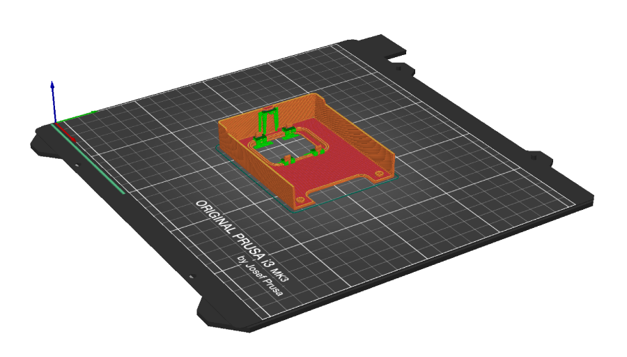

# Hardware Monitor (on LCD)


***Introducing a unique hardware dashboard for Web3Pi project.*** 

The project allows for the installation of a colorful LCD display in the Argon Neo 5 case. We have designed our own 3D model of the case cover with a space for the display. The assembly is simple, using snap-fits, with no tools required. The models are open-source, so anyone can print them on a 3D printer. The source code is also open-source, allowing users to add new functionalities, customize it to their needs, or add support for new displays.

<p align="center">
  
</p>


### Requiments

- Python >= 3.9
- Run on Raspberry Pi
- SPI interface enabled (default on Web3Pi image)
- 1.69" LCD display with ST7789V2 Driver
  - Waveshare 24382 - [product page](https://www.waveshare.com/1.69inch-lcd-module.htm)
  - Seeed Studio 104990802 - [product page](https://www.seeedstudio.com/1-69inch-240-280-Resolution-IPS-LCD-Display-Module-p-5755.html)
- (Oprional) 3D printed model of Argon Neo 5 cover

### Assembly

Connect the display to the Raspberry Pi according to the diagram below.  
The colors of the cables may vary depending on the supplier and batch. Focus on the function and pin number, not the color.

Connect `BL` to 3.3V on Raspberry Pi 5




### Installation

```shell
cd APPROPRIATE_DIRECTORY
git clone https://github.com/Web3-Pi/hardware-monitor.git
cd hardware-monitor
python3 -m venv venv
source venv/bin/activate
python3 -m pip install -r requirements.txt
deactivate
```


### Simple use

To run the service, follow the steps below:

```shell
cd APPROPRIATE_DIRECTORY/hardware-monitor
source venv/bin/activate
python3 hwmonitor.py  # Ctrl-c to shut down the monitor
deactivate
```


### 3D Model

The models are free, so anyone can print them on a 3D printer.



Download 3D model: [3D_Model](docs/3D_Model)

### 3D Printing

We recommend printing with PETG due to the high operating temperatures of the Raspberry Pi.  
To ensure the snap-fits print correctly, enable 'supports everywhere.'  
Use a 0.4mm nozzle. 0.2mm layer height.


