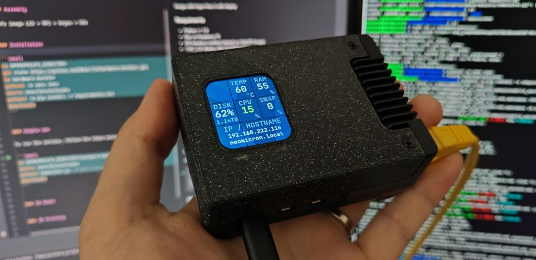
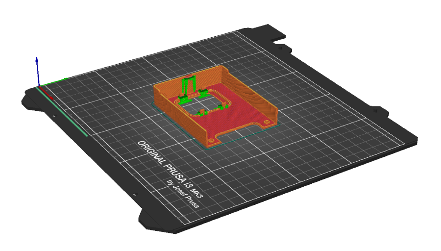

# Web3 Pi Dashboard (on LCD)


***Introducing a unique hardware dashboard for Web3Pi project.*** 

The project allows for the installation of a colorful LCD in the Argon Neo 5 enclosure.
We have designed our own 3D model of the enclosure cover with a space for the display. The assembly is simple, using snap-fits, with no tools required. The models are open-source, so anyone can print them on a 3D printer. The source code is also open-source, allowing users to add new functionalities, customize it to their needs, or add support for new displays.

<p align="center">
  
</p>


## Requirements

- Rust toolchain (`cargo`/`rustc`)
- Run on Raspberry Pi
- [SPI interface enabled](docs/EnableSPI.md) (default on Web3Pi image)
- 1.69" LCD display with ST7789V2 Driver
  - Waveshare 24382 - [product page](https://www.waveshare.com/1.69inch-lcd-module.htm)
  - Seeed Studio 104990802 - [product page](https://www.seeedstudio.com/1-69inch-240-280-Resolution-IPS-LCD-Display-Module-p-5755.html)
- (Optional) 3D printed model of Argon Neo 5 cover
- (Optional) Argon Neo 5 enclosure

## Assembly

### 1. Connect wires
Connect the display to the Raspberry Pi according to the diagram below.  
The colors of the cables may vary depending on the supplier and batch. Focus on the function and pin number, not the color.


Diagram is valid for Raspberry Pi 4 and Pi 5

If on Raspberry Pi 5 your LCD backlight is flickering connect `BL` to `3.3V PIN 17`

### 2. Mount display module

Mount the display in the printed enclosure cover. The display is held in place by four clips. Make sure all 3D printing support residues are removed and the surface to which the display adheres is flat. Install the display by sliding one side under the clips first, then pressing the other side down. Do not use excessive force to avoid damaging the display. The display should fit in easily.

Since each 3D printer may be calibrated differently, it may be necessary to adjust the scale of the 3D model in the slicer software before printing. Our prints are done on [Original Prusa i3 MK3S+](https://www.prusa3d.com/pl/produkt/drukarka-3d-original-prusa-i3-mk3s-3/).

### 3. Mount enclosure cover

Mount the enclosure cover and secure it with two screws. Make sure to arrange the cables inside the enclosure so they do not obstruct the fan and minimize interference with cooling.


## Installation

First, download the repository.

```shell
sudo apt-get install git
git clone https://github.com/Web3-Pi/web3-pi-dashboard.git
```

The dashboard runs from a **prebuilt** aarch64 binary — there is no on-device
compilation. Build it off-device with `mise run build-aarch64` (see
[Build with mise](#build-with-mise)) or drop a release binary named `w3p-hwm`
next to the scripts.

### Run as a service - (recommended)   

```shell
cd web3-pi-dashboard
sudo ./create_service.sh
```

This installs the binary to `/usr/local/bin/w3p-hwm`, the assets to
`/usr/local/share/w3p-hwm/` and enables the `w3p-hwm.service` systemd unit.

To **stop** the program, execute `sudo systemctl stop w3p-hwm.service`

To **uninstall** the service, execute `sudo ./remove_service.sh`


### or run one time

If you do not want to run the program as a service, you can run it once.   
Note: Do not use both methods simultaneously.

```shell
cd web3-pi-dashboard
./run.sh
```
To stop the program, press Ctrl+C.

## Web3 Pi vOS

Notes for running the dashboard on Web3 Pi vOS.

### Wiring

Identical to the diagram above: display on SPI0 CE0 (`/dev/spidev0.0`),
GPIO lines (BCM numbering): `DC=25`, `RST=27`, `BL=18`. The GPIO chip is
resolved by its label `pinctrl-rp1` (override with `W3P_GPIOCHIP`).

### 1. Enable SPI

SPI is **disabled by default** on vOS. Either run:

```shell
sudo ./scripts/enable-spi.sh
```

or add `dtparam=spi=on` to `/boot/firmware/config.txt` (e.g. via the control
panel's *Edit Boot Config*), then reboot.

### 2. Install

Place the prebuilt `w3p-hwm` binary next to `create_service.sh` (or build into
`target/aarch64-unknown-linux-gnu/release/`), then:

```shell
sudo ./create_service.sh
```

### Environment variables

The service works out of the box; behaviour can be tuned with the `W3P_*`
environment variables documented in [docs/Configuration.md](docs/Configuration.md)
(GPIO chip, geth RPC / beacon REST endpoints, systemd unit names, poll
interval, asset dir, install-status path, mock display).

### What the tiles mean on vOS

The top row shows one tile per Ethereum client, each with up to three lines:

| Tile | Source | Lines |
|---|---|---|
| EXEC | `geth.service` + geth JSON-RPC | service state, sync state, peer count |
| CONS | `nimbus-beacon-node.service` + beacon REST | service state, sync state, peer count |
| VALI | `nimbus-validator` | service state only |

**Line 1 — systemd service state** (`systemctl is-active`):
`running` (green), `starting` (yellow, activating/reloading), `stopped`
(gray, inactive — deliberately not red: a stopped validator is normal unless
you are staking), `failed` (red), `unknown` (gray, shown until the first
successful `systemctl` poll or for unrecognized states; if `systemctl` fails
mid-run the last known states are kept. Note: a missing or misspelled unit
name reports `inactive` and therefore shows as `stopped`).

**Line 2 — sync state** (only while the service is running):
`synced` (green), `syncing` (orange — sync in progress, or head older than
90 s: geth reports "synced" even when offline), `no api` (yellow — the
client's RPC/REST endpoint is unreachable). CONS counts as `synced` when the
sync distance is ≤ 2 slots and the beacon is not syncing. VALI never has this
line (the validator client has no sync concept here).

**Line 3 — peer count** (EXEC from `net_peerCount`, CONS from the beacon
`peer_count` endpoint), shown only when the API responded in the last poll
cycle. VALI never has this line.

## Build with mise

The project uses [mise](https://mise.jdx.dev/) for build tooling.

### 1. Install tools from `mise.toml`

```shell
mise install
```

### 2. Build AArch64 release binary (Raspberry Pi target)

```shell
mise run build-aarch64
```

### 3. Output binary path

```shell
target/aarch64-unknown-linux-gnu/release/w3p-hwm
```

## Customisation

In the Rust configuration file `src/app/config.rs`, there is a flag `SHOW_PER_CORE` that determines whether the CPU usage percentage should be in the range of `0-100%` or `0-400%`.

0-400% represents the summed load of each core in the Raspberry Pi.

```rust
# Choose how to display CPU usage percentages
pub const SHOW_PER_CORE: bool = false;
# False = [0 - 100%]
# True  = [0 - 400%]
```
note: Restart the service after making changes.   
```shell
sudo systemctl restart w3p-hwm.service
```

For full runtime/configuration values, see [docs/Configuration.md](docs/Configuration.md).


## 3D Model

The models are free, so anyone can print them on a 3D printer.


Download 3D model: [3D_Model](docs/3D_Model)

## 3D Printing

We recommend printing with [PETG](https://botland.store/849-petg-filaments?manufacturers=devil-design,prusa&weight=1000-g&material=petg&diameter=1-75-mm) filament due to the high operating temperatures of the Raspberry Pi.  
To ensure the snap-fits print correctly, enable 'supports everywhere.'  
Use a 0.4 mm nozzle.  
0.2 mm layer height or smaller.  
Our models are printed on [Original Prusa i3 MK3S+](https://www.prusa3d.com/pl/produkt/drukarka-3d-original-prusa-i3-mk3s-3/)

If you do not have access to a 3D printer, you can order an online print from one of the providers such as [JLC3DP](https://jlc3dp.com/3d-printing-quote).   
There are various materials technology and you can choose from:
- FDM - ABS, ASA or PA12-CF
- MJF - PA16-HP Nylon
- SLS - 3201PA-F Nylon


